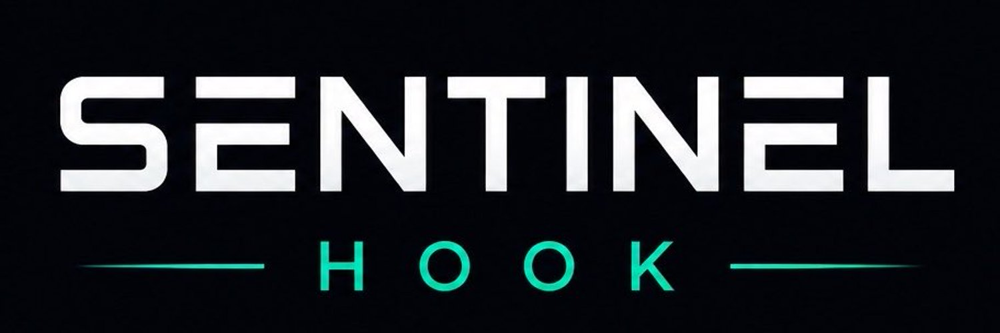

<p align="center"></p>

# Sentinel — adverse-selection-aware dynamic fees for Uniswap v4

[](https://github.com/chaosxcode/sentinel-hook/actions/workflows/test.yml)

> **Static fees charge the same. LP risk does not.**

Sentinel builds dynamic fees for Uniswap v4 that price adverse-selection risk:
low fees in normal conditions, higher LP compensation when market conditions
become dangerous. Every claim in this repo traces to committed, hash-receipted
evidence.

> **Status (2026-08-23):** Gate 1 was measured against its pre-registered bars
> and **failed criterion 3** (trade-level predictability) — published in full,
> as committed. The post-mortem found where the signal actually lives
> (**window-level loss persistence, ρ = 0.61**), and Sentinel **v2** was rebuilt
> around it: a deployable self-contained signal, calibrated fee policy that
> **beat static fees in 18/18 out-of-sample configurations**, and a working
> contract (`SentinelHookV1`) at **~14k gas overhead**. Final proof is reserved
> for the untouched holdout.
>
> Read the **[Gate 1 report](research/FINDINGS.md)** ·
> **[preregistration](research/GATE1_PREREG.md)** ·
> **[v2 calibration](evidence/gate1/calibration-vol-fee.json)**.

## The research arc, in four steps

1. **Measure the problem** — 123 sampled days of Unichain mainnet, ~4M raw v4
   events, 2,536,933 labeled trades. Adverse selection hit LPs on **126 of 126
   active pool-days**; the worst decile of 5-minute windows carried **~80% of
   all losses**. The pain is real, relentless, and concentrated.
2. **Pre-register, then publish the failure** — the v1 signal could not predict
   individual toxic trades (ρ ≈ 0.02 vs the 0.15 bar). The failure was
   published exactly as committed, with methodology, seeds, and exclusions.
3. **Diagnose and rebuild** — toxic flow *clusters in time*: trailing losses
   predict next-window losses at ρ = 0.61 (per-dollar: 0.30). A continuous,
   calibrated fee policy replayed over 2.53M trades **beat static fees in 18 of
   18 swept configurations** out-of-sample.
4. **Make it deployable** — external reference prices are impossible on-chain,
   so v2 uses a self-contained signal: EMA of realized 60-second pool-price
   moves. Validated at ρ = 0.36 against reference-priced losses, calibrated
   (+$2.98M net LP vs static on sampled days, 71% precision), and shipped as
   [`SentinelHookV1`](src/SentinelHookV1.sol).

## SentinelHookV1 — the live contract design

| Property | Where | Verified by |
|---|---|---|
| Self-contained signal (no oracle) | EMA of realized 60s pool-price moves | `test_SmallSwapsAcrossTimeProduceSignal` |
| Calibrated continuous fee: `clamp(4 × EMA, 5bps, 100bps)` | `_beforeSwap` | `test_VolatilityRampsFee_RateLimited_AndCapped` |
| Hard fee bounds (floor 0.01%, cap 1.00%) | fee clamp | 257-run fuzz: `test_Fuzz_FeeStaysWithinBoundsAndRateLimited` |
| Rate-limited changes (≤ 0.05%/update) | `_stepToward` | same fuzz |
| A trade never sets its own fee | pre-swap observation | `test_SwapCannotSetItsOwnFee` |
| Safe base-fee fallback on unknown state | `_beforeSwap` | V0 test suite (shared harness) |
| Fee decays to base when volatility subsides | time-decay EMA | `test_FeeDecaysBackTowardBaseAfterQuiet` |
| **~14k gas overhead per swap** (budget: ≤ 40k) | packed 10s-bucket sample ring | `test_GasOverheadVsNoHookPool` |

## What V0 remains

[`SentinelHookV0`](src/SentinelHookV0.sol) is the original safety skeleton
(single tick-movement signal, two tiers) kept as the baseline: its deployment
on Unichain Sepolia, the live fee-ramp demo, and its test suite document the
scaffolding every future version inherits.

## Live deployments (Unichain Sepolia)

**SentinelHookV1 (continuous toxicity pricing):**
[`0x290d2d0af6dd11b6e235eac6d7528f5474753080`](https://sepolia.uniscan.xyz/address/0x290d2d0af6dd11b6e235eac6d7528f5474753080)
— deployed CREATE2 (`0x...3080` permission suffix), with an on-chain demo:
calm swap pays the 5bps base; a sustained trend ramps the fee continuously
500 → 7,704 (0.05% → 0.77%, rate-limited steps, `FeeUpdated` events); two
quiet hours decay it back toward base. Demo script:
[`script/06_DemoSwapsV1.s.sol`](script/06_DemoSwapsV1.s.sol).

**SentinelHookV0 (safety skeleton, baseline):**
[`0xcbd5bac7b96770d7f18b97d05d6518a4d0913080`](https://sepolia.uniscan.xyz/address/0xcbd5bac7b96770d7f18b97d05d6518a4d0913080)

## Evidence index

| Artifact | Path |
|---|---|
| Gate 1 preregistration (frozen) | [research/GATE1_PREREG.md](research/GATE1_PREREG.md) |
| Gate 1 report (fail on C3, pass on C1/C2) | [research/FINDINGS.md](research/FINDINGS.md) |
| **Sentinel v2 preregistration (holdout protocol)** | [research/V2_PREREG.md](research/V2_PREREG.md) |
| Measurement plan (seeded, committed pre-ingestion) | [evidence/gate1/measurement-plan-2025.json](evidence/gate1/measurement-plan-2025.json) |
| 123 window manifests (hash-pinned) | [evidence/gate1/windows-2025/](evidence/gate1/windows-2025/) |
| Calibration: continuous policy sweep | [evidence/gate1/backtest-continuous-fee.json](evidence/gate1/backtest-continuous-fee.json) |
| Calibration: deployable vol-EMA policy | [evidence/gate1/calibration-vol-fee.json](evidence/gate1/calibration-vol-fee.json) |
| Signal validation (self-drift rejected, lookback accepted) | [evidence/gate1/self-drift-signal-validation.json](evidence/gate1/self-drift-signal-validation.json) |

## Build and test

```bash
git clone --recurse-submodules https://github.com/chaosxcode/sentinel-hook
cd sentinel-hook
forge build
forge test -vv                     # V0 + V1 Solidity suites
python3 -m unittest discover -s research/tests -v   # research pipeline tests
```

Reproduction commands for every research artifact are in
[`research/README.md`](research/README.md).

## Project links

- **Grant application:** https://chaosxcode.github.io/sentinel-hook/
- **Dated research findings:** [research/FINDINGS.md](research/FINDINGS.md)
- **Prior work — HookGuard:** transparent risk scanner for Uniswap v4 hooks:
  https://github.com/chaosxcode/hookguard

## License

MIT
